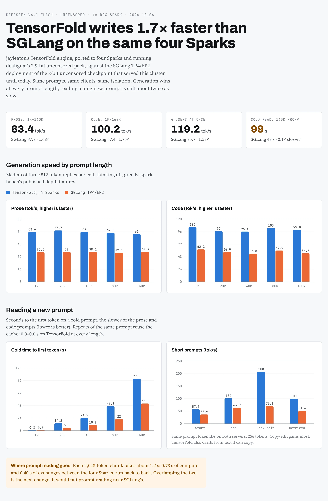

# TensorFold on four DGX Sparks vs SGLang TP4/EP2 — 2026-10-04

DeepSeek V4.1 Flash, uncensored. TensorFold: jayleaton's deepseek_v41 family ported to TP=4 (setup:
[models/deepseek-v4.1-flash/tensorfold-4x](../../models/deepseek-v4.1-flash/tensorfold-4x/README.md)), weights
`dealignai/DeepSeek-V4.1-Flash-UNCENSORED-EXL3-2.9bpw`, the recipe's production knobs (expert pruning on), one boot.
SGLang: the TP4/EP2 deployment of `dealignai/DeepSeek-V4.1-Flash-UNCENSORED-FP8`, its published depth sweep of
2026-10-02 ([tensorfold-v41-depth-20261001](../tensorfold-v41-depth-20261001/REPORT.md)).

## Depth sweep (decode tok/s, median of 3; cold time to first token of trial 0)

| prompt | TF prose | SGLang prose | TF code | SGLang code | TF cold TTFT prose / code | SGLang cold TTFT prose / code |
| ---: | ---: | ---: | ---: | ---: | ---: | ---: |
| 1k | 63.6 | 37.7 | 104.9 | 62.2 | 0.3 / 0.8 s | 0.5 / 0.5 s |
| 20k | 65.7 | 38.0 | 97.0 | 56.9 | 14.2 / 12.9 s | 5.5 / 5.3 s |
| 40k | 64.0 | 38.1 | 96.4 | 53.8 | 24.5 / 24.7 s | 10.7 / 10.8 s |
| 80k | 62.8 | 37.1 | 103.1 | 59.9 | 45.9 / 46.8 s | 22.0 / 22.0 s |
| 160k | 61.0 | 38.3 | 99.8 | 54.6 | 99.8 / 97.4 s | 48.1 / 52.1 s |
| geometric mean | 63.4 | 37.8 | 100.2 | 57.4 | | |

Warm repeats (same prompt again): TensorFold 0.26-0.64 s to the first token, SGLang 0.2-0.72 s.

Method: the spark-bench `bench-v41-depth-ab.py` with its published `fixtures.json`, 512 tokens, thinking off, greedy,
isolated with an iptables rule on port 8000 like `depth-run.sh`. Two changes for TensorFold, made by
`mk_tf_bench.py` from the original: idleness from `/health` (no `/v1/loads`) and no `/flush_cache` call (none exists;
every fixture is a new prompt, so trial 0 is cold on both servers). Runner: `depth-tf.sh`. Raw rows:
`tf4-pruned-1.jsonl`; cell medians beside SGLang's: `summary-tf4-vs-ep2.json`.

## Other cells

| cell | TensorFold | SGLang | file |
| --- | ---: | ---: | --- |
| story / code / copy-edit / retrieval, same prompt token ids, 256 tokens, median of 3 | 57.5 / 101.5 / 208 / ~100 | 36.9 / 63.9 / 70.1 / 51.4 | `short-prompts.json` (client `tf_stream_bench.py`, the twin of the SGLang `/generate` client) |
| `dsbench` single-stream median / 4-stream aggregate | 62.6 / 119.2 | 37.6 / 75.7 | `c4-tf4-isolated-1.txt` |
| campaign gates: arithmetic, `tool_choice=required`, tool continuation, strict JSON at T 0 / 0.7 / 1.0, reasoning | 7 / 7 | forced tool call fails | `campaign-gates.jsonl` |
| verify window cost 1 / 2 / 4 / 8 / 16 rows (boot calibration) | 17.3 / 20.8 / 26.0 / 36.3 / 48.9 ms | | |

## Prompt reading

`prefill-profile-r0.txt`: one 2,048-row prompt segment on rank 0 under the profiler. The GPU is busy ~95% of the
segment (~1.19 s): ~0.40 s in 43 NCCL all-gathers of bf16 partials (each rank receives three peers' 21 MB, ~3.1 ms
each) and ~0.73 s of compute, back to back. NCCL across both CX7 functions measured 2.9 ms per 2,048-row all-gather in
isolation (5.6 ms on one). Next lever: overlap the segment exchanges with compute.

## Caveats

- Different weights (2.9-bit EXL3 vs FP8/FP4): a serving comparison on one cluster, not a same-weights engine race.
- Expert pruning on (lossy; top-1 0.9944 vs 0.9961 unpruned in jayleaton's gates).
- One TensorFold boot. TensorFold's drafting is exact: drafted replies equal one-token decoding.

`chart.html` is the source of the chart image.
