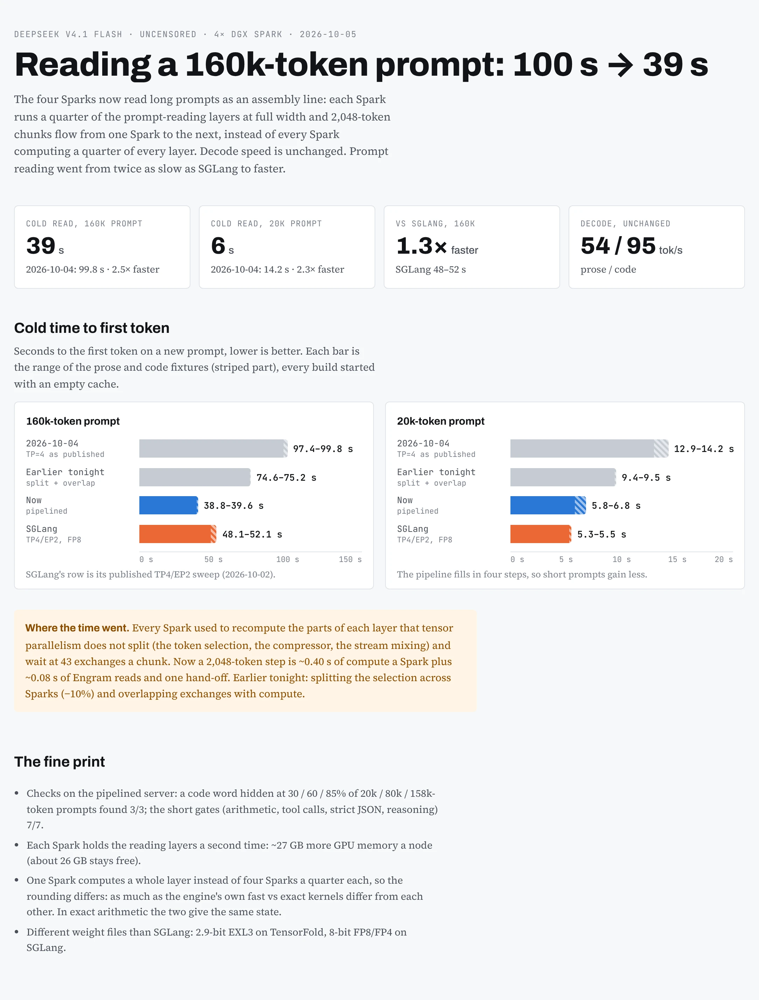

# DeepSeek V4.1 Flash on TensorFold, 4× DGX Spark

**Status (2026-10-05): serving on `forge:8000`, with pipelined prompt reading ([below](#faster-prompt-reading-2026-10-05)).** This replaced the SGLang TP4/EP2 deployment the same day; that
deployment is stopped, not removed, and is the rollback (below).

The engine is [jayleaton/deepseek-v41-tensorfold-spark](https://github.com/jayleaton/deepseek-v41-tensorfold-spark):
TensorFold 0.6.0 plus his two-Spark DeepSeek V4.1 family, with exact DSpark speculative decoding, CED prompt replay,
Engram rows read from NVMe, sessions, structured output and DSML tool calls. We ported it to four Sparks. Weights:
[`dealignai/DeepSeek-V4.1-Flash-UNCENSORED-EXL3-2.9bpw`](https://huggingface.co/dealignai/DeepSeek-V4.1-Flash-UNCENSORED-EXL3-2.9bpw)
(~197 GiB, the same uncensoring team and method as the FP8 checkpoint SGLang served).


## Results (2026-10-04)

| | TensorFold 4× Spark | SGLang TP4/EP2 (2026-10-02) | |
| --- | ---: | ---: | ---: |
| Prose decode, geometric mean over 1k–160k prompts | **63.4 tok/s** | 37.8 | 1.68× |
| Code decode, geometric mean over 1k–160k prompts | **100.2 tok/s** | 57.4 | 1.75× |
| `dsbench` 4-stream aggregate | **119.2 tok/s** | 75.7 | 1.57× |
| `dsbench` single-stream median | **62.6 tok/s** | 37.6 | 1.66× |
| Cold time to first token, 20k / 160k prompt | 14.2 s / 99.8 s (2026-10-05 pipelined: **5.8 s / 38.8 s**) | 5.5 s / 52.1 s | 2026-10-05: ~1.3× faster at 160k |
| Gates: arithmetic, forced tool call, tool continuation, strict JSON ×3 temperatures, reasoning | all pass | forced tool call fails | |

Per-depth tables, method and raw files: [artifacts/tensorfold-v41-4x-20261004](../../../artifacts/tensorfold-v41-4x-20261004/REPORT.md).

Read these with the differences in mind:
- **Different weight files.** 2.9-bit EXL3 on TensorFold against FP8 dense with FP4 experts on SGLang. Fewer bytes
  per token is most of the decode gain; this is a serving comparison on one cluster, not a same-weights engine race.
- **Expert pruning is on** (the recipe's production default, lossy: top-1 agreement 0.9944 vs 0.9961 unpruned in
  jayleaton's gates; about +5% decode). Delete its three `TF_DSV41_EXPERT_*` lines for the unpruned model.
- **One boot** of TensorFold; the SGLang rows are its published EP2 sweep.
- **Cold prompt reading is the weak spot.** A profiled 2,048-token prompt chunk spends ~0.73 s computing and ~0.40 s in
  exchanges between the four Sparks, one after the other. Overlapping them is the next change.

## Getting it

**The four-Spark support is not in jayleaton's repository yet.** Jay reviewed our [pull request](https://github.com/jayleaton/deepseek-v41-tensorfold-spark/pull/6) on 2026-10-05 and requested changes (patch `0003`,
a four-Spark launcher and docs). Until it merges, clone our fork's `four-sparks` branch: his repository with exactly
what the PR adds.

```bash
git clone --recurse-submodules -b four-sparks https://github.com/neko-legends/deepseek-v41-tensorfold-spark
cd deepseek-v41-tensorfold-spark
```

It adds `patches/0003-four-sparks.patch` (the engine changes; the Dockerfile applies every `patches/*.patch` in order
when it builds the image, so there is nothing to apply by hand), `scripts/serve4.sh`, `scripts/keeper4.sh`,
`config/tp4.env.example` and `docs/FOUR_SPARKS.md`, and fixes two things in the recipe (the Dockerfile's xgrammar
version print, and `pack_engram.py` reading the pack's nested `text_config`). Once the PR merges, use his repository
directly.

## Setup on four Sparks

Needs: four Sparks on one switched subnet per CX7 port function, passwordless ssh from the head to the three workers,
~200 GiB for the pack and ~47 GiB for Engram shards on each node, and DeepSeek's original checkpoint (any node that
packs Engram shards reads its tables).

```bash
# 1. the pack on every node, same path
hf download dealignai/DeepSeek-V4.1-Flash-UNCENSORED-EXL3-2.9bpw --local-dir <MODEL>

# 2. Engram shards, on node r (r = 0..3)
python3 scripts/pack_engram.py --src <deepseek-ai/DeepSeek-V4.1-Flash> --config <MODEL>/config.json \
    --out <ENGRAM> --world 4 --rank <r>

# 3. image, config, copy to the workers, CUDA extensions
docker build -f docker/Dockerfile -t dsv41-tensorfold:tp4 .
cp config/prod.env.example config/prod.env && cp config/tp4.env.example config/tp4.env    # fill in both
bash scripts/serve4.sh ship
bash scripts/serve4.sh prebuild

# 4. serve; the first start writes ~50 GB of prepared weights a node (~5 min), later starts take ~35 s
bash scripts/serve4.sh start
```

`docs/FOUR_SPARKS.md` (in the patched repository) explains each setting. What bit us on the first boot:
- `TF_DSV41_PREFILL_ATTN_BMQ=16`: 16 heads a rank at TP=4, and 32 does not divide.
- List both CX7 functions in `NCCL_IB_HCA`: a 2,048-row prompt exchange drops from 5.6 ms to 2.9 ms.
- A node with an unplugged port holding an address on the link subnet can drop TCP to that node (Linux keeps
  link-down routes): use the other subnet for ssh and NCCL sockets.
- Drop the page cache before a start (`MEM_GATE_GIB=104`); on GB10 cached files are GPU memory.

## Faster prompt reading (2026-10-05)



Patch `0004` (on our fork's `prefill-speed` branch, after `four-sparks`) adds three opt-in switches; we run all three:

```bash
TF_DSV41_PREFILL_PIPE=1024      # long prompts through the four Sparks as a pipeline (+~27 GB GPU memory a node)
TF_DSV41_INDEX_SPLIT=256        # short prompts: each Spark selects for a quarter of the rows (same bits)
TF_DSV41_PREFILL_OVERLAP=1024   # short prompts: exchanges behind compute (same bits)
```

Put them in `config/tp4.env` and restart (`bash scripts/serve4.sh stop && bash scripts/serve4.sh start`). A cold 160k-token
prompt: ~83 s → ~39 s; 20k: ~10.5 s → ~6 s. Memory: `MemAvailable` drops from ~50 to ~26 GB a node. How it works, the
numbers and the checks: `docs/PREFILL_SPEED.md` in the patched repository, and
[artifacts/tensorfold-v41-prefill-20261005](../../../artifacts/tensorfold-v41-prefill-20261005/REPORT.md).

## Our installation (forge, anvil, ember, flame)

| | |
| --- | --- |
| launcher | `/home/jun/tf4/serve4.sh` with `/home/jun/tf4/tp4.env` (port 8000 on all interfaces, link 192.168.10.x); image `dsv41-tensorfold:tp4pipe` with the three switches above since 2026-10-05 05:07 (rollback: `/home/jun/tf4/pf/tp4.env.before-pipeline`) |
| keeper | `/home/jun/tf4/keeper.sh` from cron: starts 4 min after a reboot, restarts after 3 failed health checks; pauses while `/home/jun/tf4/maintenance` is newer than an hour or an SGLang head container runs |
| model names | `deepseek-v4.1-flash` (alias) and `DeepSeek-V4.1-Flash-TF`; thinking on by default (effort 75), `chat_template_kwargs.thinking=false` turns it off |
| rollback to SGLang | `touch /home/jun/tf4/maintenance && /home/jun/tf4/serve4.sh stop && python3 /home/jun/tensorfold-native-20261002/restore_ep2.py` (the keeper stands down while SGLang runs) |
